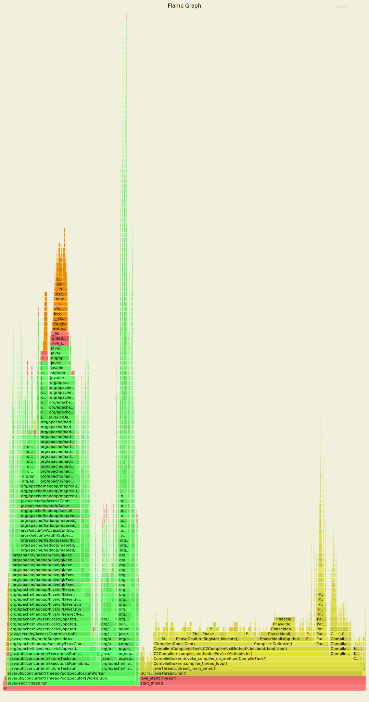
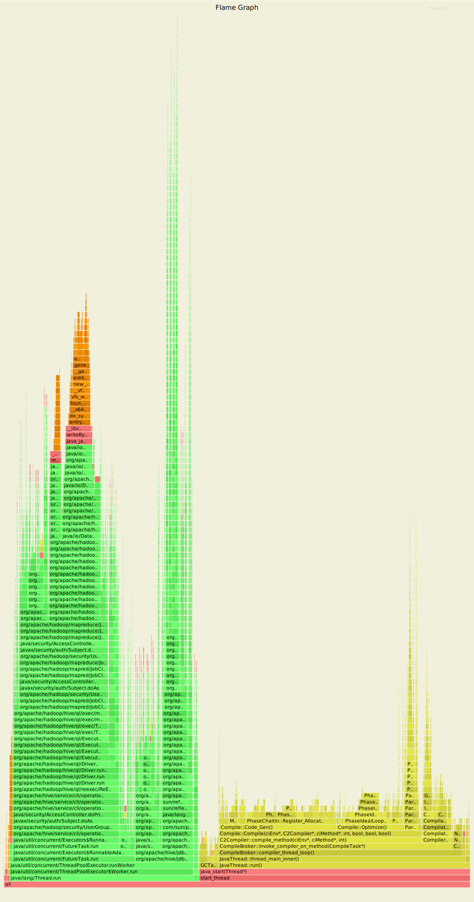
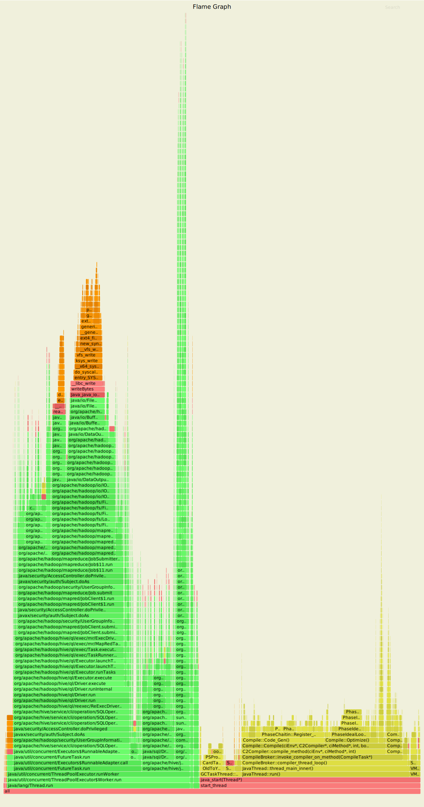
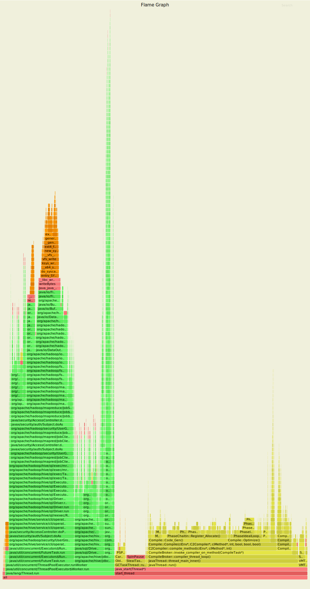

<!---
  Licensed to the Apache Software Foundation (ASF) under one
  or more contributor license agreements.  See the NOTICE file
  distributed with this work for additional information
  regarding copyright ownership.  The ASF licenses this file
  to you under the Apache License, Version 2.0 (the
  "License"); you may not use this file except in compliance
  with the License.  You may obtain a copy of the License at

  http://www.apache.org/licenses/LICENSE-2.0

  Unless required by applicable law or agreed to in writing,
  software distributed under the License is distributed on an
  "AS IS" BASIS, WITHOUT WARRANTIES OR CONDITIONS OF ANY
  KIND, either express or implied.  See the License for the
  specific language governing permissions and limitations
  under the License. -->

In this document, we examine the impact of `hive.server2.operation.log.purgePolicy.timeToLive`
property in the performance of HS2. The experiments were performed by running the following tests
and profiling the java process using async-profiler.  

    cd itests/hive-unit
    mvn test -Dtest=TestHS2OperationLoggingViaJdbc#testConcurrentQueries
    mvn test -Dtest=TestHS2OperationLoggingViaJdbc#testSerialQueries

The async-profiler command used to generate the graphs is shown below.

    ./profiler.sh -b 100000000 -d 60 -i 100000 -f out.svg PID

The PID was obtained by running `jps` and selecting the appropriate process (surefire-*).

We did four runs by changing the `purgePolicy.timeToLive` property between 1s and 100s and varying the queries which run
concurrently in HS2 between 1 and 100. In every experiment 300 queries were run in total while the profiling duration
was 1 minute. The flamegraphs from the experiments are shown below:
## Sequential queries / cleanup every 1s

Time spent in logging classes (org.apache.logging) 2.4%
## Sequential queries / cleanup every 100s

Time spent in logging classes (org.apache.logging) 0.5%
## 100 Concurrent queries / cleanup every 1s

Time spent in logging classes (org.apache.logging) 1.1% 
## 100 Concurrent queries / cleanup every 100s

Time spent in logging classes (org.apache.logging) 0.5%

As expected when the cleanup is performed very often (every 1second) this has an impact on the performance of HS2 since
Log4J2 appenders open/close many times leading to an overhead of 2.4% in the worst case.

On the other hand, as the `purgePolicy.timeToLive` value gets larger (e.g., 100sec) the logging overhead decreases.
Actually, the 0.5% mentioned above is probably the best we can get for this workload; no matter how big gets the
`purgePolicy.timeToLive` property. The 0.5% is time spend in actually logging messages and opening/closing appenders
**once** per query. The queries presented here usually take less than 2 seconds to run so any value for
`purgePolicy.timeToLive` greater than 2-3sec should lead to the same results as 100sec.
